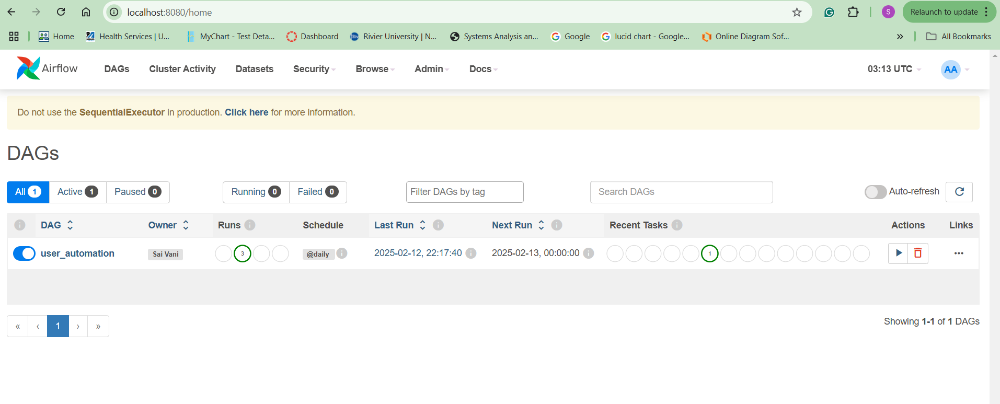
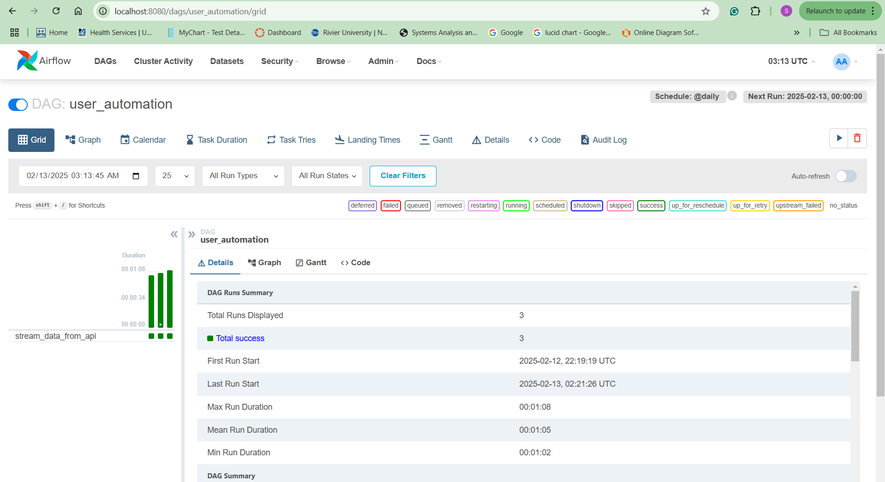
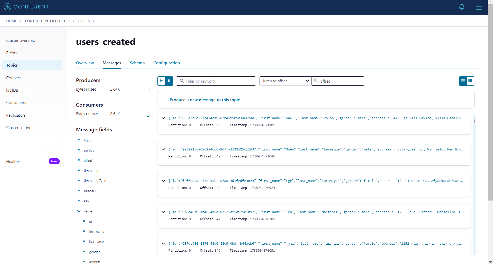
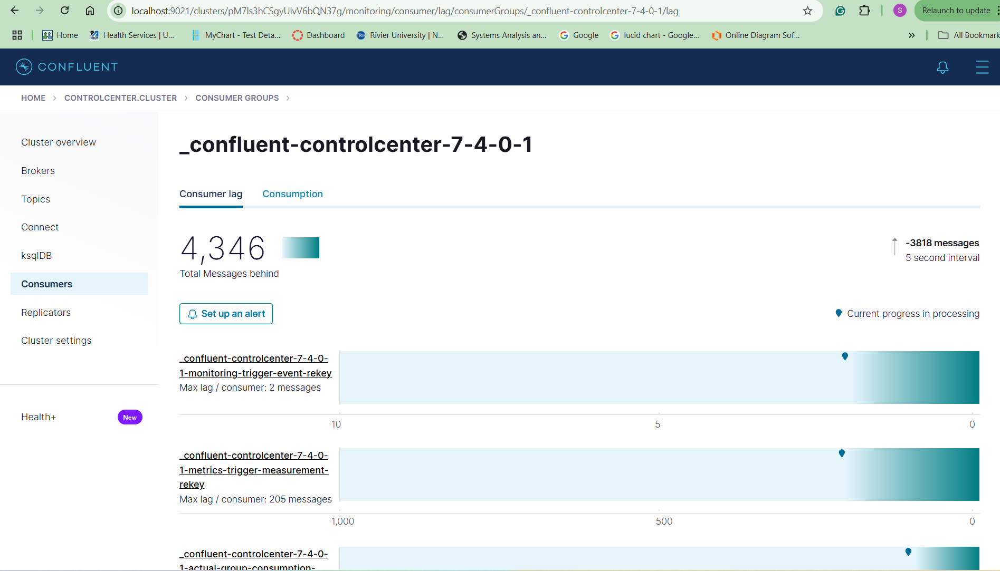
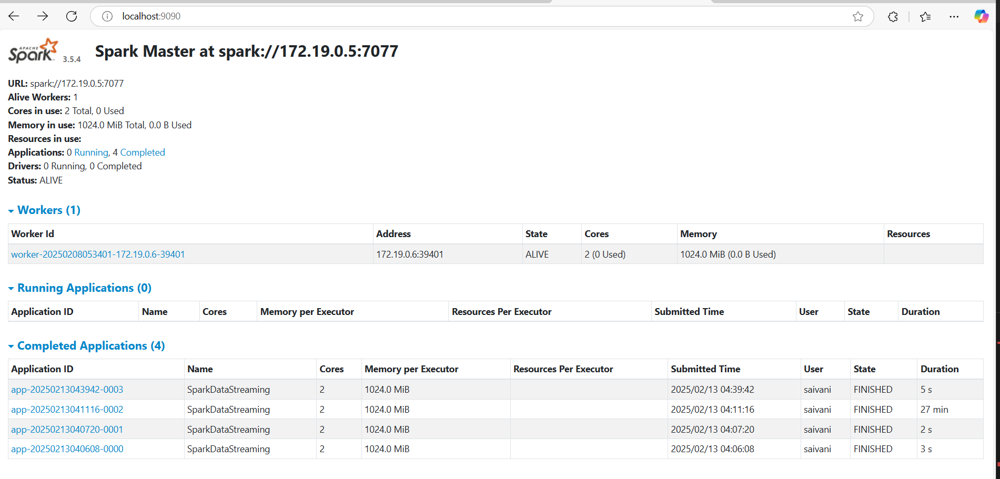
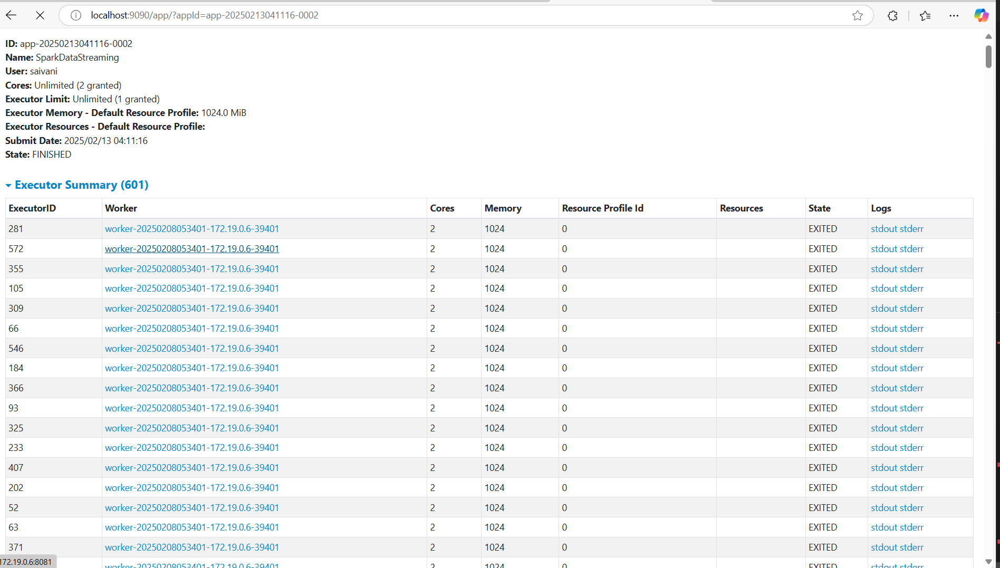
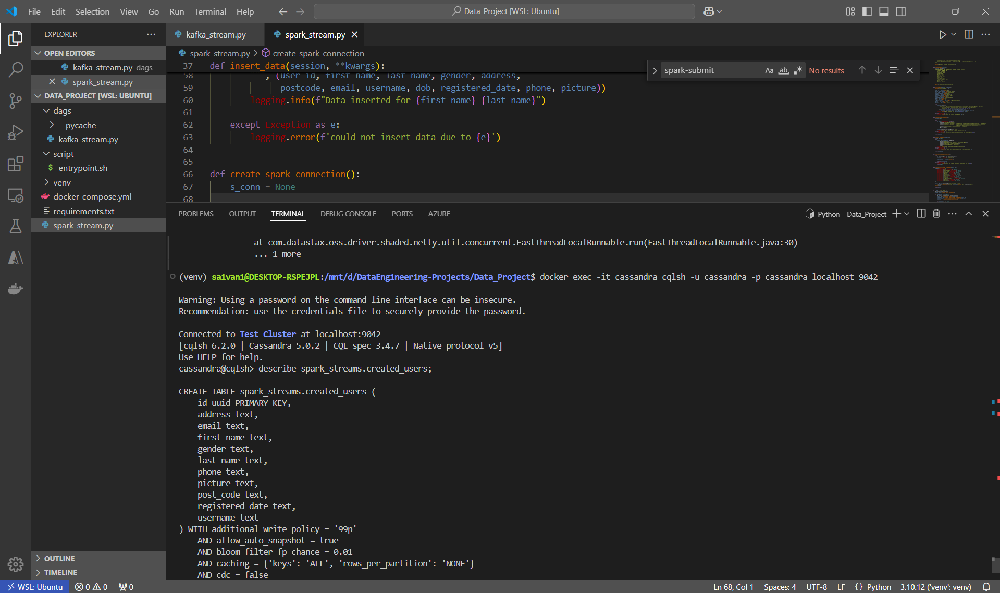
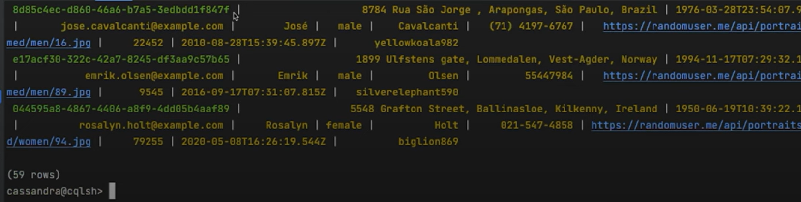

# End-to-End-Real-Time-Data-Engineering-project

## 📌 Overview
This project is a hands-on implementation of a **real-time data pipeline** using **Apache Airflow, Kafka, Spark Streaming, and Cassandra**. The pipeline is designed to extract data from an external API, stream it via Kafka, process it with Spark Streaming, and store the results in Cassandra. This project is built from scratch to demonstrate how modern data engineering tools work together to handle real-time data processing and analytics.

## 🚀 Technologies Used
- **Apache Airflow** - Task scheduling & orchestration
- **Kafka** - Real-time data streaming
- **Spark Streaming** - Real-time data processing
- **Cassandra** - NoSQL database for fast and scalable storage
- **Docker & Docker-Compose** - Containerization for environment consistency
- **Python** - Data extraction and processing scripts

## 🧠 What You Can Learn From This Project
- By working on this project, you'll gain hands-on experience in building and managing a real-time data pipeline. Here's a breakdown of what you can learn:

- Data Ingestion & Streaming: You will learn how to ingest data from external sources (e.g., APIs), stream it in real-time using Kafka, and manage message flow between producers and consumers.

- Data Processing with Spark Streaming: Learn how to leverage Spark Streaming to process large amounts of data in near-real-time. You'll understand the concepts of micro-batches and how to process data at scale.

- Workflow Orchestration with Airflow: Gain experience in using Apache Airflow for scheduling and orchestrating data pipelines. You will learn how to define DAGs (Directed Acyclic Graphs), manage task dependencies, and monitor execution.

- Real-Time Data Storage with Cassandra: Learn how to store processed data in a NoSQL database like Cassandra, which is designed for fast, scalable storage and can handle large volumes of data in real-time.

- Containerization with Docker: You will get familiar with using Docker and Docker Compose to containerize the services (Kafka, Spark, Airflow, Cassandra) to ensure consistency and portability across environments.

- Monitoring & Debugging Skills: As you set up and monitor the pipeline, you will enhance your debugging skills, learning how to inspect logs, monitor job execution, and ensure smooth data flow across the components.

## 📊 Architecture Diagram
Below is the architecture of the pipeline showcasing the data flow from extraction to storage.


### **Pipeline Steps:**
1. **Airflow DAG** triggers the data ingestion process.
2. **Kafka Producer** sends extracted data to Kafka topics.
3. **Spark Streaming** consumes Kafka data, processes, and transforms it.
4. **Cassandra** stores the processed data for querying.

## ⚙️ Project Setup Guide
### Prerequisites
Ensure you have the following installed before proceeding:
- **Docker & Docker Compose**
- **Python 3.x**
- **Git**
- **Kafka & Zookeeper (via Docker)**

### Clone This Repository
```bash
git clone https://github.com/Saivani-Mehatha/Real-Time-Data-Pipeline.git
cd Real-Time-Data-Pipeline
```

### Install Python Dependencies
```bash
pip install -r requirements.txt
```

### Start Required Services
```bash
docker-compose up -d
```

This will spin up all necessary services, including Kafka, Zookeeper, and Cassandra.

## ▶️ Running the Pipeline
### 1️⃣ Start Airflow & Trigger DAG
- Open Airflow UI: [http://localhost:8080](http://localhost:8080)
- Enable & trigger the DAG `real_time_pipeline`

📸 **Screenshots:**
- 
- 

### 2️⃣ Validate Kafka Streaming
To verify data flow in Kafka, check available topics and consume messages:
```bash
kafka-topics.sh --list --bootstrap-server localhost:9092
kafka-console-consumer.sh --topic users_stream --from-beginning --bootstrap-server localhost:9092
```
�� **Screenshots:**
- 
- 

### 3️⃣ Monitor Spark Processing
- Access Spark UI: [http://localhost:9090](http://localhost:9090)
📸 **Screenshots:**
- 
- 

### 4️⃣ Query Data in Cassandra
To check stored data, connect to Cassandra using cqlsh:
```bash
cqlsh> SELECT * FROM users_stream;
```
📸 **Screenshots:**
- 
- 

## 🔥 Additional Notes for Beginners
If you're new to real-time data engineering, here are some key takeaways:
- **Airflow DAGs**: Define workflows, dependencies, and scheduling.
- **Kafka Producers & Consumers**: Kafka acts as a message broker between data sources and consumers.
- **Spark Streaming**: Processes micro-batches of data for real-time transformations.
- **Cassandra Storage**: A highly scalable NoSQL database for structured storage.

### 📚 Useful References
- [Apache Airflow Documentation](https://airflow.apache.org/docs/)
- [Kafka Quick Start](https://kafka.apache.org/quickstart)
- [Spark Streaming Guide](https://spark.apache.org/docs/latest/structured-streaming-programming-guide.html)
- [Cassandra Documentation](https://cassandra.apache.org/doc/latest/)

## 🤝 Contributing
Contributions are welcome! If you find any issues or improvements, feel free to open a **Pull Request** or raise an **Issue**.

## 📌 Final Thoughts
This project is a **great hands-on experience** for understanding real-time data processing. It provides exposure to a real-world tech stack used by data engineers and big data professionals. 🚀

If you have any questions, feel free to reach out or contribute to the project!

